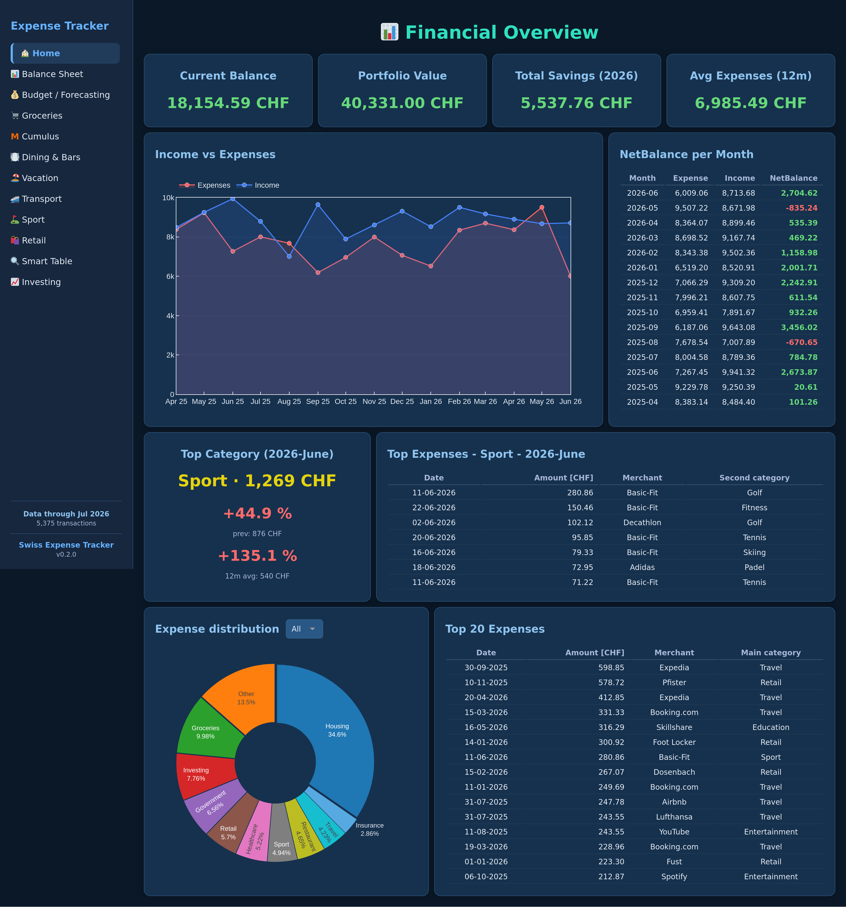
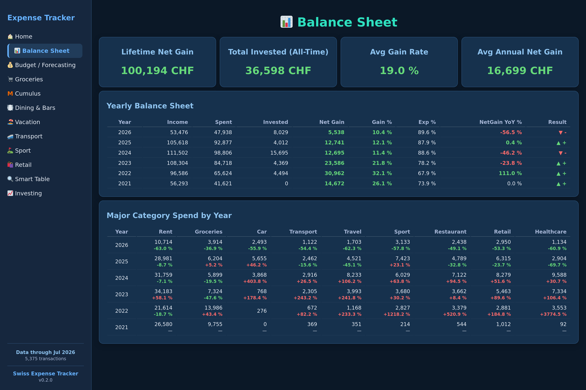
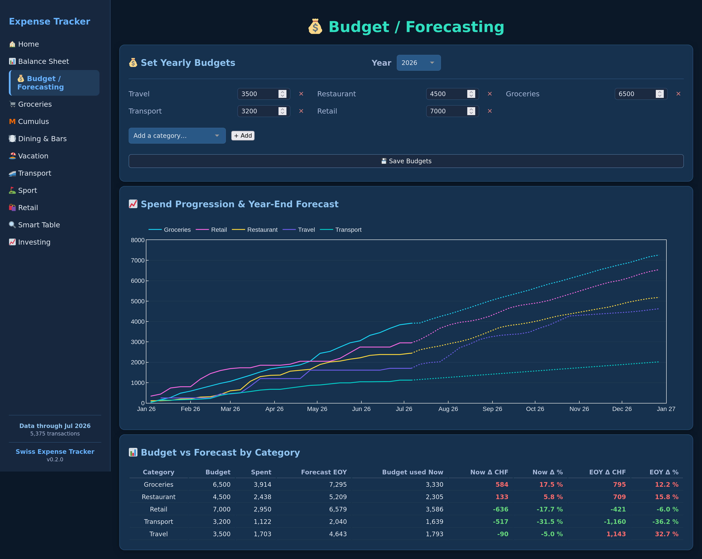
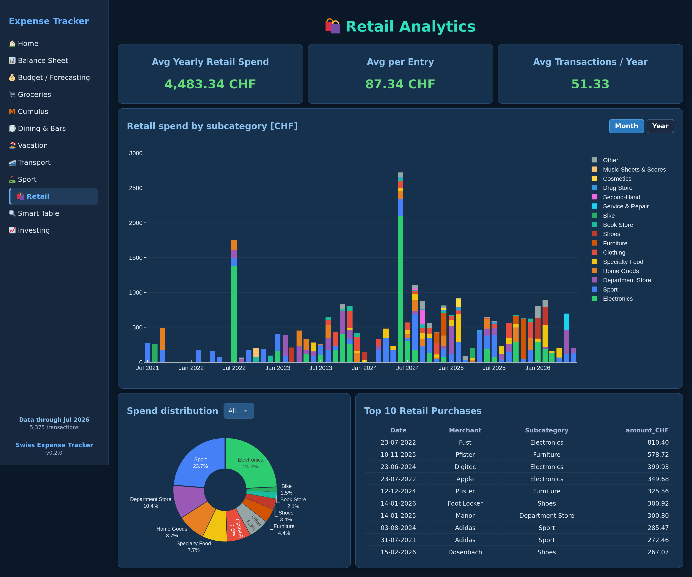
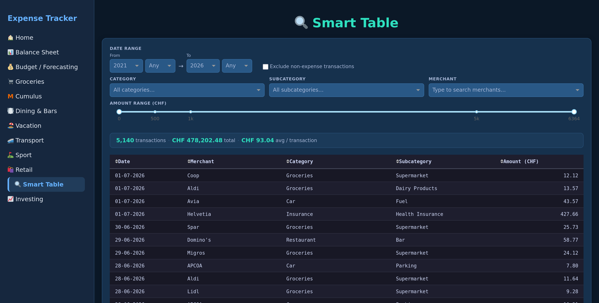
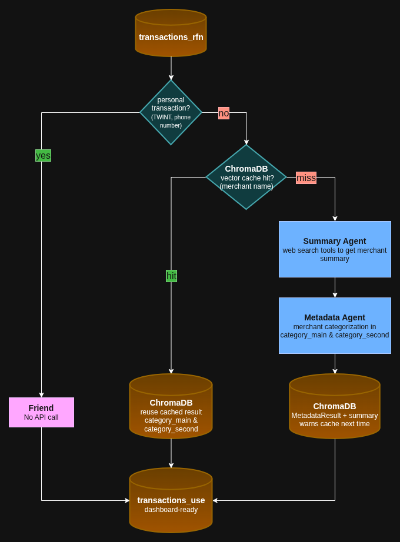

# 🇨🇭 Swiss Expense Tracker 📈


👤 **Author**: _Sebastian Müller – Data Scientist & AI Engineer_

💡 **Status:** This project is under active development. Features may change, and some components may not be fully stable yet. Feedback is welcome!

Ever reach the end of the month, open your banking app, and you are asking yourself: where did all my money go? I'm so glad you ask and congrats for finding this page because the pain is finally over! 🎉

**Swiss Expense Tracker** turns that monthly existential crisis into actual answers. Drop your bank exports in a folder 📂, run one command ⚡, and an AI agent pipeline 🤖 labels every transaction, breaks down your spending by merchant and category 🏷️, tracks your investments 📈, and serves it all up in a slick interactive dashboard ✨. You'll know exactly why you're broke 💸. Which is somehow better than not knowing 🙃

> 🏦 Built for ZKB, UBS, Viseca, Revolut, Swissquote, and Migros.

---

## 📋 Table of Contents

- [✨ What it does](#-what-it-does)
- [📊 Dashboard](#-dashboard)
- [🤖 The Agentic Pipeline](#-the-agentic-pipeline)
  - [🌐 Smart web search](#-smart-web-search)
- [🏷️ Transaction Categories](#-transaction-categories)
- [🚀 Getting Started](#-getting-started)
  - [📁 Download your bank data](#-download-your-bank-data)
  - [🔑 Configure API keys](#-configure-api-keys)
  - [📦 Install](#-install)
  - [🧑‍💻 Develop in a container](#-develop-in-a-container)
  - [🐳 Run with Docker](#-run-with-docker)
  - [▶️ Run the pipeline](#-run-the-pipeline)
  - [🖥️ Launch the dashboard](#-launch-the-dashboard)
- [🔎 Validate pipeline results](#-validate-pipeline-results)
  - [✏️ Post-processing](#️-post-processing)
  - [🗄️ Databases &amp; Vector stores](#️-databases--vector-stores)
- [📚 Dev Docs](#-dev-docs)
- [🛠️ Tech Stack](#-tech-stack)
- [📄 Licence](#-licence)

---

## ✨ What it does

- 📥 **Ingests** bank CSV/XLS exports from multiple Swiss sources with full deduplication
- 🤖 **Enriches** every transaction using an AI agent pipeline — merchant web search + LLM extracts merchant name, categories, and city
- ⚡ **Caches** results in a local ChromaDB vector store so each merchant is only looked up once
- 🛒 **Categorises** grocery articles at item level (from Migros receipts) using a second agent pipeline
- 📈 **Tracks** Swissquote investment portfolio snapshots over time
- 🎨 **Visualises** everything in an interactive Plotly Dash dashboard

---

## 📊 Dashboard

A dark-themed, fully interactive Plotly Dash app. A few highlights:

#### 🏠 Home

Your financial cockpit at a glance — current balance, monthly income vs. expenses, net balance per month, top spending category, and an expense-distribution donut.



#### 📊 Balance Sheet

Year-by-year income, spending, investing and net gain with savings & YoY rates, all-time KPIs, and major-category spend per year. Gives you the big picture about your financial situation with high level expenses and incomes.



#### 💰 Budget / Forecasting

Set a per-category budget for the year, then let the model project your end-of-year spend. It uses seasonal pacing (so a mid-year snapshot isn't naively doubled) and handles lumpy categories, and shows you at a glance where you stand now (Budget used Now) and where you'll likely land (Forecast EOY), with a per-category table flagging over/under budget.



#### 🛍️ Retail

Typical category based page with expenses by category and you can change the view by month or year.

Retail spending broken down by subcategory, an annual spend donut, and your largest individual purchases.



#### 🔍 Smart Table

Detected any suspicious transaction or exceptional big spike in the data? The fully filterable transaction browser helps you to find any transaction and you can slice it by date range, category, subcategory, merchant and amount. Sort the table to see the biggest transactions at the top.



> _Screenshots use synthetic demo data, so no real data or figures are shown._

### Pages

| Page                          | What you see                                                                                                                                                                           |
| ----------------------------- | -------------------------------------------------------------------------------------------------------------------------------------------------------------------------------------- |
| 🏠**Home**              | Balance progression, net balance per month, top spending category, expense distribution                                                                                                |
| 📊**Balance Sheet**     | Yearly income / spent / invested / net gain with gain & YoY rates, all-time KPIs (lifetime net gain, total invested, avg gain rate, avg annual net gain), major-category spend by year |
| 💰**Budget / Forecasting** | Per-category yearly budgets, seasonally-paced end-of-year forecast, lumpy-category handling, budget-used-now KPIs, over/under table                                                   |
| 🛒**Groceries**         | Store breakdown (Migros, Coop, Lidl, Aldi, ...), spend distribution                                                                                                                    |
| **M Cumulus Analytics** | Item-level grocery analysis: categories, health score, top articles                                                                                                                    |
| 🍽️**Dining & Bars**   | Restaurant & grocery spend by frequency, per-visit box plots                                                                                                                           |
| 🏖️**Vacation**        | Annual travel spend by type (flights, hotels, car rental)                                                                                                                              |
| 🚄**Transport**         | Yearly transport costs by subcategory, monthly heatmap, car expenses                                                                                                                   |
| ⛳**Sport**             | Sport spending by activity type over time                                                                                                                                              |
| 🛍️**Retail**          | Retail breakdown by subcategory, spend donut, top purchases                                                                                                                            |
| 🔍**Smart Table**       | Fully filterable transaction browser                                                                                                                                                   |
| 📈**Investing**         | Portfolio value vs. invested, P&L, per-position progression                                                                                                                            |

---

## 🤖 The Agentic Pipeline

The heart of this project. A web search finds the actual merchant description, and an LLM structures it into clean categories.

1. 🔍 Detect if transaction contains TWINT keyword or starts with a phone number (+xx).
2. ⛁ Check in ChromaDB if merchant already exists by running similarity search with web search result and defined `category_main` and `category_second`
3. 🌐 Run Summary Agent which performs a web_search on the merchant to get information about what the merchant is doing, the products they sell and who their customers are.
4. 🏷️ Run Metadata Agent which takes the result of the web_search and categorises the merchant based on predefined categories in `category_main` and `category_second`.
5. 💾 Save results in ChromaDB and write transaction with defined categories into `transactions_use`.



### 🌐 Smart web search

Free tiers are exhausted before falling back to pay-per-use. API credit consumption is tracked monthly per provider.

For every Provider an API key must be stored in the `.env` file.

Depending on the Provider make sure to set usage limits to not fall into the pay-per-use mode if you don't want to spend any money on the web searches.

| Priority | Provider                   | Free quota        |
| -------- | -------------------------- | ----------------- |
| 1        | Tavily                     | 1 000 req/month   |
| 2        | Brave Search               | 1 000 req/month   |
| 3        | Scrape.do                  | 1 000 req/month   |
| 4        | Exa                        | 500 credits/month |
| 5–6     | Tavily / Exa (pay-per-use) | unlimited         |

⚙️ **Concurrency** — 5 transactions run in parallel. Unique merchants are prioritised first so cache entries are warm before repeated merchants are processed.

🛒 **Grocery enrichment** runs a separate, lighter pipeline: no web search needed — a single LLM agent categorises articles from their name and store location using a grocery-specific ChromaDB cache.

---

## 🏷️ Transaction Categories

Two-level hierarchy assigned by the metadata agent:

**Main categories:**
`Sport` · `Entertainment` · `Telecommunication` · `Restaurant` · `Healthcare` · `Government` · `Retail` · `Groceries` · `Salary` · `Housing` · `Car` · `Transport` · `Travel` · `Insurance` · `Education` · `Payment Services` · `Investing` · `Postal Services` · `Friend`

Sub-categories refine each main category (e.g. Sport → Tennis / Padel / Fitness / Cycling; Restaurant → Dining / Fast Food / Cafe / Bar).

The category combination is based on personal preference and can be freely adjusted. To add or change categories:

1. Edit the `CategoryMain` and `CategorySecond` enums in `pipeline_agentic/data_models/merchant.py`.
2. Update the category descriptions and sub-category lists in the prompt inside `pipeline_agentic/agents_/agent_metadata.py` to reflect the change — the agent relies on these descriptions to categorise correctly.

---

## 🚀 Getting Started

### 📁 Download your bank data

#### 🏦 ZKB (Zürcher Kantonalbank)

1. Log in to ZKB eBanking.
2. **Account & Payments → Private account**
3. Click **More options**, select your time frame.
4. Scroll to the bottom, click **Show all**.
5. Top right: **CSV → with Details** — the `with Details` option is required.

Place the file in `lnd/zkb/`.

#### 💳 Viseca (credit card)

1. Log in to ZKB eBanking.
2. **Cards → Credit cards → Overview VisecaOne → Next**
3. Click **Bills → Download .csv**, select your time frame.

Alternatively, log in directly at visecaone.com.

Place the file in `lnd/viseca/`.

#### 🔄 Revolut

1. Log in to Revolut.
2. At **Home** select one Currency at the top left corner.
3. Click **Statement** →**Excel**
4. Select time range and click **Generate**
5. Do this for all your Currencies from which you want to import the data.

Place the file in `lnd/revolut/`.

> If a currency in your statement is not yet listed under `Currency` in `pipeline_ingestion/data_models/transaction.py`, you need to add it first.

#### 📈 Swissquote (investment positions)

1. Log into Swissquote.
2. Click on your Trading account.
3. Under **Portfolio** →**Positions** click the **Export** button the the top right corner.
4. Positions data is directly downloaded as `.xls`

Place the file in `lnd/swissquote/`.

#### 🛒 Migros (grocery receipts via M Cumulus)

1. Log in to your Migros account.
2. In the top right corner click on your initials and then **Kassenbons**
3. Under account.migros.ch go to **Einkäufe** and then click **Herunterladen**
4. Select time frame and then click **Tabelle herunterladen**

Place the file in `lnd/migros_grocery/`.

---

### 🔑 Configure API keys

Create a `.env` file in the project root:

```env
# Path to the folder that contains your lnd/ directory (bank export landing zone)
DATA_DIR=/path/to/your/data

OPENAI_API_KEY=sk-...

# Web search providers (at least one required)
TAVILY_API_KEY=...
BRAVE_API_KEY=...
SCRAPE_DO_API_KEY=...
EXA_API_KEY=...
```

`DATA_DIR` must point to the parent folder of `lnd/`. Create the subdirectories for each source you use and place your bank exports there:

```
$DATA_DIR/
└── lnd/
    ├── zkb/
    ├── ubs_debit/
    ├── ubs_credit/
    ├── viseca/
    ├── revolut/
    ├── swissquote/
    └── migros_grocery/
```

You only need keys for the providers you want to use — the pipeline tries them in order and skips any that are unconfigured. **Tavily** has a generous free tier and is the recommended starting point.

For OpenAI, `gpt-4o-mini` is used by default — inexpensive and accurate enough for categorisation. Check [OpenAI pricing](https://platform.openai.com/docs/pricing) before running.

---

### 📦 Install

```bash
git clone https://github.com/smueller-lab/SwissExpenseTracker.git
cd SwissExpenseTracker
python3 -m venv venv && source venv/bin/activate
pip install poetry && poetry install
```

---

### 🧑‍💻 Develop in a container

Prefer a ready-made, reproducible development environment over installing Python,
Poetry, and the toolchain by hand? The repo ships a **[Dev Container](https://containers.dev/)**
(`.devcontainer/`). It gives every contributor the exact same setup — the pinned
Python 3.12, Poetry, and the full dev toolchain (ruff, black, mypy, pytest) — with
zero host setup beyond Docker and an editor that speaks Dev Containers.

> ℹ️ This is the **contributor** path (editing the code). If you just want to run the
> app on your own data, use [🐳 Run with Docker](#-run-with-docker) instead.

**Prerequisites:** [Docker Desktop](https://www.docker.com/products/docker-desktop/)
and [VS Code](https://code.visualstudio.com/) with the
[Dev Containers extension](https://marketplace.visualstudio.com/items?itemName=ms-vscode-remote.remote-containers)
(or any editor that supports the [Dev Container spec](https://containers.dev/supporting), and GitHub Codespaces works too).

**Open it:**

1. Open the cloned folder in VS Code.
2. Run **Dev Containers: Reopen in Container** from the command palette (`F1`).
3. The first build installs dependencies into a persistent volume (~2 min); later
   starts are near-instant because the volume is reused.

Once inside, the usual commands work — the container mirrors the project conventions
(ruff format-on-save, the `mypy` config from `pyproject.toml`), and port `8050` is
forwarded automatically:

```bash
poetry run python src/swiss_exp_tracker/app/app.py   # dashboard → http://localhost:8050
poetry run pytest                                    # tests
poetry run python -m ruff check src                  # lint
```

> ℹ️ The container is code-only. To run the pipeline or see real data in the dashboard
> you still need your `.env` keys and bank exports — see the two steps in
> [🐳 Run with Docker](#-run-with-docker) for `.env` and `bank_data/`.

---

### 🐳 Run with Docker

Prefer not to install Python and Poetry? The whole app runs in Docker — the only
prerequisite is [Docker Desktop](https://www.docker.com/products/docker-desktop/).

> 🔑 **Your keys stay yours.** `.env` is never copied into the image, so each person
> supplies their **own** API keys and spends only their **own** free-tier credits.
> The merchant cache and database live in local folders, so every merchant is looked
> up once and your usage is tracked separately from anyone else's.

**1. Add your keys.** Copy the template and fill in your own keys:

```bash
cp .env.example .env      # then edit .env and paste in your API keys
```

**2. Add your bank exports.** By default they go in a `bank_data/lnd/` folder next to
the compose file:

```bash
mkdir -p bank_data/lnd    # put your bank CSV/XLS exports inside bank_data/lnd/
```

To keep your data **outside the repo**, point `DATA_DIR` in `.env` at any folder — a
sibling directory or an absolute path — and put your exports under its `lnd/`
subfolder. This is the same `DATA_DIR` used for local (non-Docker) runs, so one
setting covers both:

```dotenv
# .env
DATA_DIR=../bank_data            # or an absolute path like /mnt/finance/bank_data
```

```bash
mkdir -p ../bank_data/lnd
```

Compose mounts whatever `DATA_DIR` points to into the container, so nothing sensitive
ever lives in the repo. If `DATA_DIR` is unset it falls back to `./bank_data`.

**3. Build the database + enrich your transactions** (needs your keys; runs the full
pipeline):

```bash
docker compose run --rm pipeline
```

**4. Launch the dashboard:**

```bash
docker compose up dashboard
```

Open [http://localhost:8050](http://localhost:8050). Re-running step 3 after adding new
exports is safe — already-processed files are skipped.

> ℹ️ Run the pipeline (step 3) **before** the dashboard — the dashboard loads the
> database that the pipeline produces. The `database/`, `merchant_vector_store/`, and
> `grocery_vector_store/` folders persist between runs so your data and cache survive
> container restarts.

---

### ▶️ Run the pipeline

```bash
poetry run python src/swiss_exp_tracker/pipeline.py
```

This runs all stages in order:

1. 📥 **Ingestion** — detects new files, validates rows, normalises merchants
2. 🤖 **Agentic enrichment** — AI agent looks up merchant metadata via web search
3. 🛒 **Grocery enrichment** — AI agent categorises individual Migros articles
4. 🧹 **Post-processing** — applies manual correction rules on top of the agent output, before anything is written to `transactions_use`. This is where hard-to-detect transactions are handled: salary payments, rent transfers, and any merchant the agent consistently miscategorises. Two files control this step:
   - `pipeline_agentic/clean_pipeline_output.py` — exact-match and substring-based category overrides for merchant transactions
   - `pipeline_agentic/transactions_use.py` — amount-based corrections and shared-cost adjustments (e.g. splitting a shared rent payment)
5. 🔗 **Final join** — produces the dashboard-ready `transactions_use` table

♻️ Re-running is safe — already-processed files and transactions are skipped.

---

### 🖥️ Launch the dashboard

```bash
poetry run python src/swiss_exp_tracker/app/app.py
```

Open [http://localhost:8050](http://localhost:8050) in your browser.

---

## 🧐 Validate pipeline results

### ✏️ Post-processing

After the pipeline runs, **you need to review and edit one file** before the dashboard data is accurate. The agent does a great job on ordinary merchants, but some transactions require rules that only you can define:

| Situation                                                        | What to do                                                                              |
| ---------------------------------------------------------------- | --------------------------------------------------------------------------------------- |
| Salary deposits or other predictable income                      | Add your employer name(s) under `salary.employers`                                    |
| Rent transfers with a known amount history                       | Add the landlord under `housing.rent` with the amounts list                           |
| Shared rent with a flatmate                                      | Add a `shared_housing` entry with the roommate's monthly offset                       |
| A one-off deposit (e.g. rental deposit)                          | Add a `housing.deposits` entry with a minimum amount threshold                        |
| Recurring self-transfers to a brokerage                          | Add an `investing.transfers` entry with the exact transaction dates                   |
| A travel package booked through a person                         | Add a `travel.all_inclusive` entry with the merchant and year                         |
| A merchant always put in the wrong category                      | Add a `custom_rules` entry with the correct `category_main` and `category_second` |
| One specific transaction got the wrong merchant name or category | Add a `reference_id_corrections` entry with the reference ID from the DB              |

**Auto-detection** runs as part of the pipeline and writes `pipeline_agentic/config/detected_rules.yaml` automatically — it picks up salary employers and recurring rent merchants from your transaction history without any manual input. Review that file after the first run; if the detected values look correct you do not need to add anything to `user_config.yaml` for those fields.

> After editing `user_config.yaml`, re-run the pipeline. The full pipeline runs, but ingestion and agentic enrichment are no-ops when no new CSV files are present. The correction stages (post-clean and transactions_use) always re-process **all** existing rows, so your config changes are applied to every historical transaction.

---

### 🗂️ Custom corrections reference (`user_config.yaml`)

All manual corrections live in `pipeline_agentic/config/user_config.yaml`. The pipeline never writes to this file, so your edits are always preserved. Below is a fully annotated example covering every available key:

```yaml
salary:
  # Merchant substrings classified as your main salary income.
  # Auto-detection fills this automatically; add entries here only to extend or correct it.
  employers:
    - "Acme AG"
    - "Freelance GmbH"

  # Merchants to remove from the auto-detected employer list (false positives).
  employers_exclude:
    - "some detected false positive"

  # One-off income transfers from a named person classified as salary donations.
  donations:
    - name: "max mustermann"

housing:
  # Recurring rent payments. List every amount the rent has been at over time
  # so that historical transactions are also classified correctly.
  # If a merchant appears in both detected_rules.yaml and here, your entry wins.
  rent:
    - merchant: "landlord name"
      amounts: [1200.0, 1150.0, 1100.0]

  # Merchant names to remove from the auto-detected rent list (false positives).
  rent_exclude:
    - "debit standing order"

  # One-time deposits (e.g. a rental security deposit).
  # Any transaction from this merchant above min_amount is classified as Housing/Deposit.
  deposits:
    - merchant: "landlord name"
      min_amount: 2400.0

investing:
  # Self-transfers to a brokerage account. Use exact dates to avoid misclassifying
  # any other future transfer from the same person.
  transfers:
    - merchant: "investing account"
      dates: ["2024-09-02", "2025-01-21", "2026-04-02"]
    # Alternatively, use min_amount if the merchant is unique enough and you transfer regularly:
    # - merchant: "swissquote bank"
    #   min_amount: 500.0

travel:
  # Lump-sum travel packages booked through a person (e.g. a group trip organiser).
  # Prefer exact dates so only that specific transaction is affected.
  # Use year as a fallback if you only know the year and the merchant is unique enough.
  all_inclusive:
    - merchant: "trip organiser name"
      dates: ["2025-07-31"]

merchant_renames:
  # Rename a merchant's display name without changing its category.
  # match:       text compared (case-insensitive) against the enriched merchant name
  # rename_to:   the clean name shown in the dashboard instead
  # exact_match: false (default) — substring match; true — full merchant name must match exactly.
  - match: "store_express"
    rename_to: "store"

custom_rules:
  # Catch-all overrides: any transaction whose merchant contains this substring
  # gets the specified category, regardless of what the agent decided.
  # category_main and category_second must match the enum values in the codebase.
  # exact_match: false (default) — substring match; true — full merchant name must match exactly.
  - merchant: "my gym"
    category_main: "Sport"
    category_second: "Gym"
  - merchant: "fuel station keyword"
    category_main: "Car"
    category_second: "Fuel"
  - merchant: "exact merchant name"
    category_main: "Payment Services"
    category_second: "Money Transfer"
    exact_match: true

reference_id_corrections:
  # Pinpoint corrections keyed by the transaction's stable reference_id.
  # The reference_id appears in transactions_use.reference and in the DB.
  - reference_id: "NOID-abc123..."
    merchant: "Correct Merchant Name"
    category_main: "category_1"
    category_second: "category_2"
```

---

### ⛁ Databases and Vector stores

Before launching the dashboard, it is worth inspecting the pipeline output directly. Use a VS Code extension such as **SQLite** or **SQLite Viewer** to browse the database files.

To rerun certain transactions the `enrichment_status` of that transaction must be changed back to `enriched`. The entry in the vector store must also be deleted.

Two directories are created after the first pipeline run:

#### Databases

`database/` contains the two SQLite databases:

| File                | Interesting tables                                                                                                                             |
| ------------------- | ---------------------------------------------------------------------------------------------------------------------------------------------- |
| `transactions.db` | `transactions_rfn` — normalised raw transactions after ingestion; `transactions_use` — final dashboard-ready table after post-processing |
| `positions.db`    | Swissquote investment position snapshots                                                                                                       |

#### ChromaDB vector stores

Two ChromaDB stores persist the agentic pipeline results so each merchant is only looked up once:

- **`merchant_vector_store/`** — one entry per unique merchant, including the raw web search result and the assigned categories
- **`grocery_vector_store/`** — one entry per grocery article

The table to inspect inside each ChromaDB SQLite file is **`embeddings_queue`**. It contains both the categories assigned by the metadata agent and the web search text used to derive them — making it the right place to validate that a merchant was categorised correctly and that the web search returned useful content.

---

## 📚 Dev Docs

Detailed technical documentation lives in `.dev-docs/`:

| Doc                                                             | Contents                                                          |
| --------------------------------------------------------------- | ----------------------------------------------------------------- |
| [`01-agentic-pipeline.md`](.dev-docs/01-agentic-pipeline.md)     | Agent architecture, ChromaDB cache, web search chain, data models |
| [`02-ingestion-pipeline.md`](.dev-docs/02-ingestion-pipeline.md) | All ingestion stages, supported sources, DB schema                |
| [`03-dashboard.md`](.dev-docs/03-dashboard.md)                   | Every dashboard page, KPI cards, chart specs                      |
| [`04-pipeline-dash.md`](.dev-docs/04-pipeline-dash.md)           | Pre-aggregation pipeline that feeds the dashboard                 |
| [`05-budget-forecasting.md`](.dev-docs/05-budget-forecasting.md) | Year-end forecast model, seasonal pacing, lumpy-category handling |
| [`06-database-and-sql.md`](.dev-docs/06-database-and-sql.md)     | aiosql query layer, connection helpers, table creation/migrations |
| [`07-running-and-deployment.md`](.dev-docs/07-running-and-deployment.md) | Pipeline entry point, local + Docker run, config, versioning      |

---

## 🛠️ Tech Stack

| Component              | Technology                                |
| ---------------------- | ----------------------------------------- |
| Pipeline & data models | Python 3.12, Pydantic v2, SQLite          |
| AI agents              | OpenAI Agents SDK (`gpt-4o-mini`)       |
| Merchant cache         | ChromaDB (cosine-similarity vector store) |
| Web search             | Tavily, Brave Search, Scrape.do, Exa      |
| Dashboard              | Plotly Dash, Plotly                       |
| Dependency management  | Poetry                                    |

---

## 📄 Licence

This project is licensed under the **GNU General Public License v3.0**. See [LICENCE](LICENCE) for the full text.
